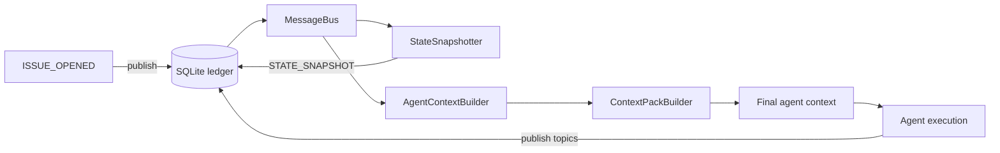
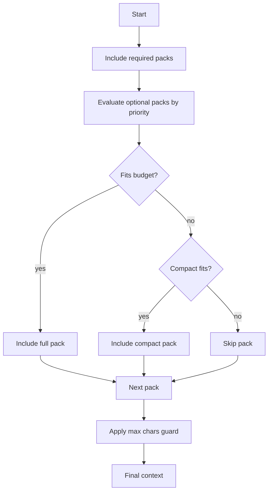
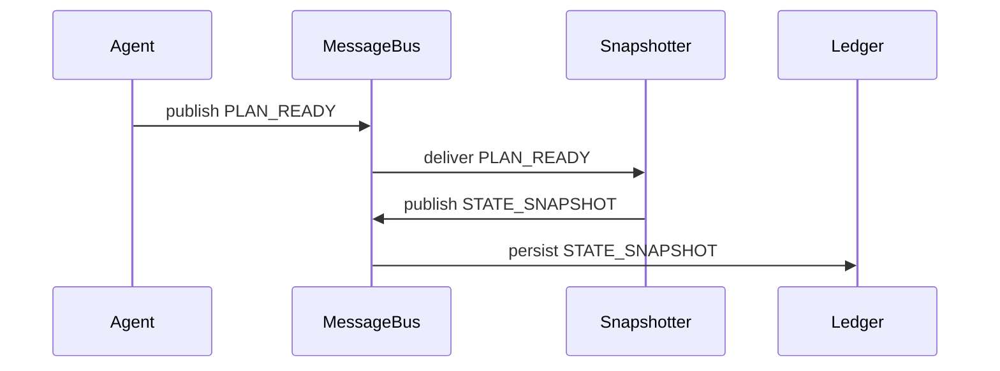

# Context Management

Zeroshot builds agent prompts from ledger history with explicit selection rules, a token budget,
and a durable state snapshot. This document explains the technology and how to configure it in
templates.

## Technology stack

- Ledger: SQLite message log per cluster (`~/.zeroshot/<id>.db`).
- MessageBus: publish/subscribe wrapper over the ledger.
- AgentContextBuilder: assembles prompt sections and context sources.
- ContextPackBuilder: priority and budget based selection with compact variants.
- StateSnapshotter: derives `STATE_SNAPSHOT` from structured outputs.
- Context metrics: optional logs or ledger entries for observability.

## Data flow



## Prompt assembly sections

The builder assembles the prompt as a set of packs:

- Header and non-interactive rules
- Agent instructions and output schema
- Source sections from `contextStrategy.sources`
- Validator skip hints (validator role only)
- Triggering message (always included at the end)

## Context strategy sources

`contextStrategy.sources` controls which ledger messages are pulled into an agent prompt.

| Field           | Type                              | Purpose                     | Default                                   |
| --------------- | --------------------------------- | --------------------------- | ----------------------------------------- |
| topic           | string                            | Ledger topic name           | required                                  |
| sender          | string                            | Filter by sender            | none                                      |
| since           | string or timestamp               | Lower bound for timestamps  | none                                      |
| strategy        | latest \| oldest \| all           | Selection semantics         | latest if amount set, else all            |
| amount          | number                            | Max messages to include     | none                                      |
| limit           | number                            | Deprecated alias for amount | none                                      |
| priority        | required \| high \| medium \| low | Pack priority               | derived if missing                        |
| compactAmount   | number                            | Amount for compact mode     | 1                                         |
| compactStrategy | latest \| oldest \| all           | Compact selection           | latest if base strategy is all, else base |

`since` accepts: `cluster_start`, `last_task_end`, `last_agent_start`, or an ISO timestamp string.

### Selection semantics

- `latest`: query DESC with limit, then reverse to render chronologically.
- `oldest`: query ASC with limit.
- `all`: query ASC with no limit (or a hard cap if amount is set).

### Priority defaults

If `priority` is missing, the builder assigns:

- required: `STATE_SNAPSHOT`, `ISSUE_OPENED`, `PLAN_READY`
- high: `VALIDATION_RESULT`, `IMPLEMENTATION_READY`
- medium: everything else

Templates should set priority explicitly for clarity.

## Context packs and budgeting

Context is built as a set of packs that are selected under a token budget. Each pack can provide
full and compact text. Required packs are always included first.



Budgeting details:

- Token estimates use `estimateTokensFromChars` (chars / 4, rounded up).
- `maxTokens` controls selection; default is 100000 if unset.
- A defensive max chars guard caps the final context to 500000 chars.
- Required packs are preserved; if the max chars guard triggers, optional packs are compacted or
  dropped first, then required packs are truncated as a last resort.

## STATE_SNAPSHOT (durable working memory)

`STATE_SNAPSHOT` is a structured summary of current cluster state. It is derived from ledger
messages and republished whenever relevant updates occur.

### Update triggers

State is updated from these topics:

- `ISSUE_OPENED`
- `PLAN_READY`
- `WORKER_PROGRESS`
- `IMPLEMENTATION_READY`
- `VALIDATION_RESULT`
- `INVESTIGATION_COMPLETE`



Include `STATE_SNAPSHOT` as a required context source for workers, planners, and validators.

## Context metrics and observability

Enable context metrics:

- `ZEROSHOT_CONTEXT_METRICS=1` prints metrics to stdout.
- `ZEROSHOT_CONTEXT_METRICS_LEDGER=1` publishes a `CONTEXT_METRICS` message.

Metrics include:

- total chars and estimated tokens
- per section and pack breakdown
- budget and truncation details

## Example context strategy

```json
{
  "contextStrategy": {
    "sources": [
      { "topic": "ISSUE_OPENED", "priority": "required", "strategy": "latest", "amount": 1 },
      { "topic": "STATE_SNAPSHOT", "priority": "required", "strategy": "latest", "amount": 1 },
      { "topic": "PLAN_READY", "priority": "required", "strategy": "latest", "amount": 1 },
      {
        "topic": "VALIDATION_RESULT",
        "priority": "high",
        "since": "last_task_end",
        "strategy": "latest",
        "amount": 5,
        "compactAmount": 1
      },
      {
        "topic": "WORKER_PROGRESS",
        "priority": "medium",
        "since": "last_task_end",
        "strategy": "latest",
        "amount": 3,
        "compactAmount": 1
      }
    ],
    "maxTokens": 100000
  }
}
```

## Troubleshooting

- Missing anchors: ensure required sources are present and priority is set to required.
- Stale messages: verify `strategy: \"latest\"` and that `amount` is set.
- Over budget: lower `maxTokens` or add `compactAmount` to optional sources.
